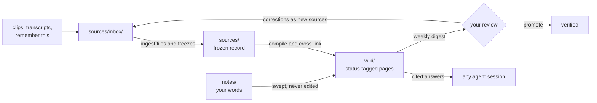

# exocortex

[](LICENSE)
[](https://ko-fi.com/V1N723QW1K)

An agent-maintained personal knowledge system, shipped as pure markdown.

**TL;DR** — You capture things (articles, meeting notes, decisions, stray thoughts) and write notes however you already do. An AI maintainer compiles all of it into a personal wiki: cross-linked, provenance-tracked, and marked with how much each claim can be trusted. Your knowledge compounds instead of rotting in a pile of notes — and any agent you work with inherits the context to act like a colleague who's been in the room for years, not a smart stranger meeting you fresh every session. It's all markdown in a folder you own; no app, no database, no lock-in.

<p align="center">
  <a href="https://ko-fi.com/V1N723QW1K">
    
  </a>
</p>

## See it work

Mid-conversation, any vault session (demo data):

> **You:** remember this — pricing call with Sara: she pushed back hard on per-seat (expansion friction), we're going usage-based for the beta, revisit when churn data lands
>
> **Maintainer:** Captured and filed. `wiki/projects/beta-launch.md` (draft) records the decision with provenance "you, 2026-07-12" and links to `people/sara-chen.md`. One tension flagged: `concepts/pricing-models.md` cites your March note preferring per-seat — queued as a dispute for your next digest.

*Three weeks and many conversations later:*

> **You:** what did we decide about beta pricing, and why?
>
> **Maintainer:** Usage-based, decided 2026-07-12 (draft, your own words): Sara pushed back on per-seat over expansion friction; revisiting when churn data lands. The March per-seat preference was flagged as a dispute and you resolved it in the 07-15 digest review — usage-based won. Sources: the 07-12 capture, the 07-15 review.

And on disk, that capture became a page. What you dropped in:

```markdown
call w/ sara — beta pricing
- she hates per-seat, cites expansion friction
- going usage-based for the beta
- revisit after churn data lands (sept?)
```

What the maintainer compiled (excerpt of `wiki/projects/beta-launch.md`):

```markdown
---
type: Project
status: draft
sources:
  - ../../sources/calls/2026-07-12-beta-pricing-call.md
---
## Pricing
Usage-based for the beta — decided on the [2026-07-12 call](../../sources/calls/2026-07-12-beta-pricing-call.md)
after [Sara Chen](../people/sara-chen.md) pushed back on per-seat
(expansion friction). Revisit when churn data lands (~Sept 2026).
```

Every claim carries its origin; the page says how much to trust it (`draft` until you promote it); the raw capture stays frozen forever as the record of what was actually said.

<!-- screenshots: drop here — Obsidian graph view of a populated vault, a wiki page with status frontmatter, a digest. Shoot from a demo vault, not a real one. -->

## Quick start

Paste this into [Claude Code](https://claude.com/claude-code) — or whatever coding agent you use — with this repo's URL filled in:

> Clone `<this repo's URL>`, read its INSTALL.md, and help me set up my own exocortex vault on this machine.

That's the install. The agent interviews you (vault location, sync, private remote, scheduling), runs the setup, fills in your deployment bindings, and smoke-tests the pipeline before handing you the keys. [INSTALL.md](INSTALL.md) is its script; [SETUP.md](SETUP.md) is the same procedure as a manual guide. Updating later is the same move — one prompt to your agent; releases are announced in [CHANGELOG.md](CHANGELOG.md) (watch the repo to get notified). (Claude Code is the maintainer runtime the system is built for — the skills register automatically in its vault sessions — but any capable agent can run the install.)

## Your first five minutes

After install, in a session inside the vault:

1. **Drop any markdown file into `sources/inbox/`** — meeting notes, a pasted article, a half-formed thought.
2. **Say "process my inbox."** Watch it file the source, spin up or update draft wiki pages, and cite provenance on every claim.
3. **Ask "what do you know about ‹the thing you just dropped›?"** — you get an answer with receipts.
4. **Say "remember this: …" mid-conversation**, anytime. Same pipeline, zero ceremony.
5. When the digest shows up (or you say **"what needs my review"**), skim it and promote what's solid.

That's the whole loop — capture → compile → review — and week one needs nothing more.

## What you get

- **A wiki that writes itself.** Drop a source in the inbox and the maintainer files it, summarizes it, links it to what you already know, and updates the pages it affects. You never organize anything by hand.
- **Answers with receipts.** Ask a question and the `query` skill answers from *your* accumulated knowledge, citing the pages and sources behind every claim — weighted by how verified each one is.
- **An honest knowledge base.** Every claim is traceable to who said it and when. Machine inferences are labeled as inferences. Contradictions get flagged as disputes instead of silently overwritten. A guess never wears the typography of a fact.
- **Agents with real context.** The vault doubles as an agent substrate: any session opened inside it knows your projects, your people, your history, and your rules. This is the difference between delegating to a colleague and re-briefing a stranger.
- **Your words stay yours.** The maintainer never edits your notes — it reads them, links to them, and compiles from them. Sources are frozen records; corrections arrive as new statements, never rewrites of old ones.
- **Rules you can renegotiate.** The whole system runs on legible markdown rules (you're looking at them). When a rule chafes, the `amend` skill changes it — with your approval, logged, reversible.

## What using it feels like

**Capture without ceremony.** Clip an article from your browser, drop a meeting transcript in the inbox, or just tell the agent "remember this" mid-conversation. Provenance is recorded at capture time; nothing needs tidying first. Bringing years of notes from another app? There's a migration workflow for that — batched and review-paced ([SETUP.md § 9](SETUP.md)).

**Maintenance happens while you're not looking.** Scheduled runs drain the inbox, sweep your notes for changes, snapshot history to a private git remote, and lint the wiki for contradictions and staleness. You wake up to a vault that's more organized than you left it.

**You stay the editor-in-chief.** A periodic digest surfaces what needs human eyes: new connections the agent proposed, disputes it found, drafts worth promoting. Reviewing it takes minutes; promoting a page to `verified` is deliberately a human act. Curation is the one job the system refuses to automate — what enters and what gets trusted is yours to decide, and the system's quality is bounded by exactly that.

**You ask, it knows.** Months later, "what did we decide about X, and why?" gets an answer with the decision, the reasoning, the source, and the date — because the system was built for the retrieval moment, not the filing moment.

## Why this is an unlock

LLMs reset every session; your context doesn't survive the conversation. Notes apps have the opposite problem: everything survives, nothing is synthesized, and the pile grows less useful as it grows. This system closes the loop between the two — machine labor does the synthesis continuously, epistemic guardrails keep the result trustworthy, and the whole thing lives in files any agent can read. The payoff compounds: every captured source makes the wiki smarter, and every agent session starts from everything you've ever fed it.

**Lineage:** Karpathy's LLM-wiki pattern (Apr 2026) → Google's [Open Knowledge Format](https://github.com/GoogleCloudPlatform/knowledge-catalog) v0.1 (Jun 2026) → this system.

## How it works

This repository is the **program**: the rules, principles, and skill procedures that govern the maintainer, plus setup tooling. It contains no personal data. Your knowledge — sources, notes, the compiled wiki — stays in your own vault (itself a git repo with a private remote, if you keep history). The two never mix: the boundary is defined in [CONSTITUTION.md](CONSTITUTION.md) § *Sharing and boundaries*.



- **One write pipeline.** Knowledge enters the wiki only through `sources/inbox/`, a sweep of your notes, or a skill. No ad-hoc writes.
- **Sources are frozen speech.** A source is a record of what was said, never edited — truth-status lives one layer up, in the wiki, where claims can be disputed and retracted without falsifying the record. Corrections arrive as *new* sources, even when they come from you.
- **Trust is graduated, not gated.** The agent writes freely as `draft`; promotion to `verified` is a human act; every reader weights pages by status. A mostly-draft wiki is healthy by design.
- **Rules live where they bind.** Invariants in [CLAUDE.md](CLAUDE.md) (one page, hard budget), procedures in [.claude/skills/](.claude/skills/), folder law in each folder's README, principles in [CONSTITUTION.md](CONSTITUTION.md). No rule lives twice.
- **The system is its own tester.** Friction gets filed as issues ([ISSUES.md](ISSUES.md)); repeated rule overrides trigger amendment proposals; a weekly digest surfaces everything for human review. The rules are a pact you authored and may renegotiate — never a cage.

The maintainer's skill set: `ingest` · `process-inbox` · `session-capture` · `query` · `lint` · `digest` · `audit-exocortex` · `vault-snapshot` · `amend` · `publish-program` · `update-exocortex`.

## Key terms

<details>
<summary>The vocabulary you'll see everywhere (10 terms)</summary>

- **program** — shippable system markdown per MANIFEST: rules, skills, glossary, and supporting conventions; no personal data.
- **bundle** — a contained folder of related knowledge; bundles nest freely (e.g. the krux/ bundle inside projects/). Unqualified, "the bundle" still means the outermost one: wiki/ alone, the OKF-conformant export surface — not the vault and not the program. (Sense widened per the user, 2026-07-20.)
- **vault** — the whole personal knowledge installation: sources, notes, wiki, attachments, and pipeline bookkeeping.
- **wiki** — agent-maintained compiled knowledge layer in wiki/; claims carry status and provenance.
- **ingest** — skill that files a source and compiles it into wiki pages.
- **digest** — skill that compiles the user-facing review surface from pipeline output.
- **lint** — skill that runs vault health checks and queues fixes.
- **draft** — wiki status: hypothesis-grade; usable but say so when it matters.
- **verified** — wiki status: human-promoted ground truth; scarce by design.
- **provenance** — traceable origin of a claim (source path, URL, or the user's dated words).

Full glossary → [GLOSSARY.md](GLOSSARY.md)

</details>

## What's in this repo

<details>
<summary>Map of the repository</summary>

| Path | What it is |
|---|---|
| [CLAUDE.md](CLAUDE.md) | The one-page invariant core every agent session loads |
| [CONSTITUTION.md](CONSTITUTION.md) | Principles, roles, anti-patterns, residence map |
| [GLOSSARY.md](GLOSSARY.md) | Canonical system vocabulary (term meanings, not procedures) |
| [.claude/skills/](.claude/skills/) | The maintainer skill procedures |
| [ISSUES.md](ISSUES.md), [.state/README.md](.state/README.md) | Friction-log and bookkeeping conventions |
| [templates/](templates/) | Note frontmatter template |
| [meta/](meta/) | Reference docs: the design doctrine and build handoff (historical), the pinned OKF spec, and the deployment-bindings template |
| [INSTALL.md](INSTALL.md) | Agent-guided setup — paste one prompt into your coding agent and it installs the system |
| [SETUP.md](SETUP.md), [tools/](tools/) | Manual deployment guide, vault bootstrap script, and the maintainer's publish tooling |

</details>

## Deploying by hand

The [Quick start](#quick-start) above is the recommended path. To do it yourself instead ([Obsidian](https://obsidian.md) makes a nice viewer, but the files are the interface):

```sh
git clone <this repo>   # somewhere NOT managed by iCloud/Dropbox/etc.
cd exocortex
./tools/bootstrap.sh /path/to/your/vault
```

…and follow [SETUP.md](SETUP.md) from there: fill in your `meta/DEPLOYMENT.md` bindings, git-init the vault with a private remote, optionally schedule the maintenance skills, and start dropping things into `sources/inbox/`. For everyday capture, the [Obsidian Web Clipper](https://obsidian.md/clipper) pointed straight at your inbox — with a provenance-carrying template and its optional LLM tidy pass — makes clipping a one-click act; SETUP.md § 7 has the exact configuration.

## License

The system files are MIT-licensed ([LICENSE](LICENSE)). The pinned copy of the OKF spec ([meta/OKF-SPEC.md](meta/OKF-SPEC.md)) is from Google's [knowledge-catalog](https://github.com/GoogleCloudPlatform/knowledge-catalog) repository, Apache 2.0.
